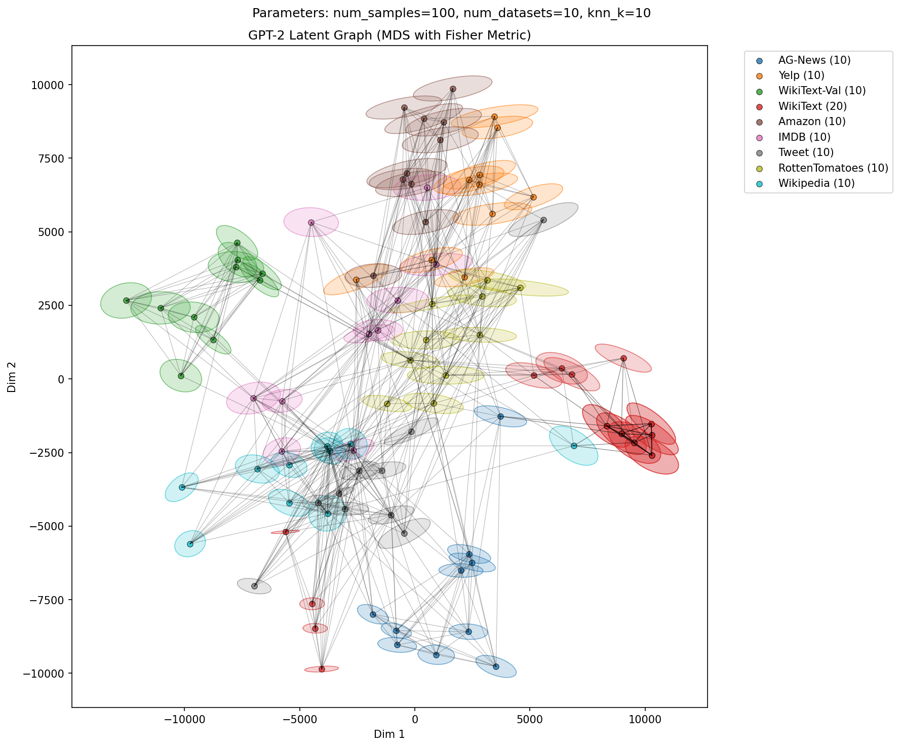
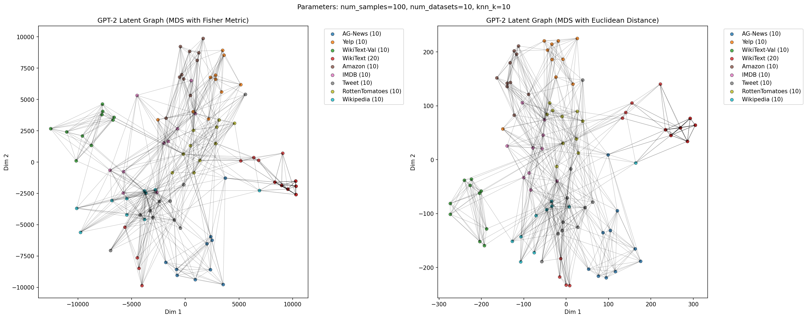

# LLM Latent Space Visualization with Fisher Information Metric

This repository provides tools for analyzing and visualizing the latent space of Language Models using Fisher Information Metrics. The project enables geometric analysis of LLM embeddings and comparison between different distance metrics.




## 🌟 Features

- **Fisher Information Metric Computation**: Compute FIM for each data point in the latent space
- **Graph-based Geodesic Distances**: Construct k-NN graphs and compute shortest paths
- **Interactive Visualization**: Streamlit-based GUI for exploring latent space geometry
- **Multiple Embedding Methods**: Compare Fisher-based vs Euclidean distances
- **MDS & t-SNE Comparison**: Visualize different dimensionality reduction techniques
- **Ellipse Visualization**: Display Fisher metrics as 2D ellipses on MDS plots

## 📋 Requirements

- Python 3.8+
- CUDA-capable GPU (recommended for faster processing)
- Docker & Docker Compose
- NVIDIA Docker runtime (for GPU support)

## 🚀 Quick Start

### 1. Clone the repository

```bash
git clone <repository-url>
cd latent_graph
```

### 2. Build and start Docker container

```bash
docker-compose up -d
docker-compose exec latent_graph bash
```

### 3. Install dependencies (if needed)

```bash
pip install -r requirements.txt
```

### 4. Run the full pipeline

```bash
# Extract embeddings and Fisher metrics
python src/extract.py --config src/config.yaml

# Build k-NN graphs (Fisher and Euclidean)
python src/graph.py --config src/config.yaml
python src/graph_euclidean.py --config src/config.yaml

# Project Fisher metrics to 2D
python src/project_metrics_2d.py --config src/config.yaml

# Compute geodesic distances and MDS
python src/geo.py --config src/config.yaml

# Generate comparison visualizations
python src/compare_fisher_euclidean.py --config src/config.yaml
python src/compare.py --config src/config.yaml
```

### 5. Launch Streamlit GUI

```bash
streamlit run app_streamlit.py
```

## ⚙️ Configuration

Edit `src/config.yaml` to customize your analysis:

```yaml
model_name: gpt2-large        # LLM model to use
max_length: 256               # Maximum sequence length
num_samples: 100              # Number of samples per dataset
num_datasets: 10              # Number of datasets to use
seed: 42                      # Random seed
lambda_reg: 0.0001            # Regularization for Fisher metric
knn_k: 15                     # k for k-NN graph construction
artifacts_dir: artifacts_gpt2_large_multi  # Output directory

dataset:
  name: multi_source          # Dataset name
  config: default
  split: train
```

### Supported Datasets

- **multi_source**: Multiple datasets (Wikipedia, WikiText, SQuAD, IMDB, etc.)
- **newsgroup**: 20 Newsgroups classification dataset
- **JeanKaddour/minipile**: MiniPile dataset
- Any custom HuggingFace dataset

## 📁 Project Structure

```
.
├── app_streamlit.py              # Streamlit GUI application
├── src/
│   ├── extract.py                # Embedding & FIM extraction
│   ├── graph.py                  # Fisher-based k-NN graph
│   ├── graph_euclidean.py        # Euclidean k-NN graph
│   ├── project_metrics_2d.py     # 2D projection of Fisher metrics
│   ├── geo.py                    # Geodesic distance computation
│   ├── compare_fisher_euclidean.py  # Comparison visualization
│   ├── compare.py                # MDS vs t-SNE comparison
│   ├── tsne.py                   # t-SNE visualization
│   ├── llm_map.py                # Multi-model comparison
│   ├── config.yaml               # Configuration
│   └── utils.py                  # Utility functions
├── assets/                       # Visualization images for README
├── artifacts_*/                  # Results (generated, gitignored)
├── report/                       # Documentation
├── requirements.txt              # Python dependencies
├── docker-compose.yml            # Docker configuration
├── Dockerfile.python             # Docker image definition
└── README.md                     # This file
```

## 🎨 Visualizations

The project generates several types of visualizations:

1. **MDS with Fisher vs Euclidean**: Comparison of geodesic distances computed using Fisher and Euclidean metrics
2. **Fisher Metric Ellipses**: 2D visualization of Fisher information matrices as ellipses
3. **Distance Scatter Plot**: Correlation between Fisher and Euclidean distances
4. **MDS vs t-SNE**: Comparison of different dimensionality reduction techniques

All plots support:
- Interactive hover information
- Toggleable edges and ellipses
- Label-based color coding
- Configurable k-NN parameters

### Example Visualizations

**Fisher Metric vs Euclidean Comparison:**



## 📊 Results

Results are saved in the `artifacts_dir` directory:
- `embeddings/`: Embedding vectors and metadata
- `metrics/`: Fisher information matrices
- `metrics_2d/`: 2D projected Fisher metrics
- `graphs/`: NetworkX graph objects
- `geodesic/`: Geodesic distance matrices
- `plots/`: Generated visualizations


## 📚 References

- Information Geometry and its Applications (Amari, 2016)
- The Riemannian geometry of the space of probability distributions (Amari & Nagaoka, 2000)
- The Pile: An 800GB Dataset of Diverse Text for Language Modeling (Gao et al., 2020)


